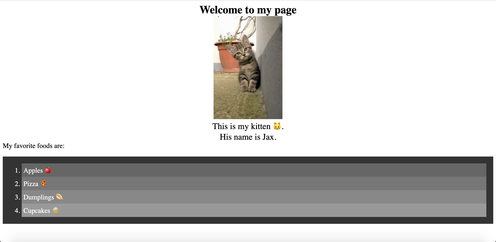

+++
title = "04. Traverse DOM 👩‍🎓👨‍🎓"
weight = 4
tags = ["web apis"] 
+++

# 🐛 Style Changes on HTML Elements Not Rendering on Page

Work with a partner to resolve the following issues:

* Users should be able to see style changes implemented with JavaScript when the browser page loads.

* Fix the code so that the actual behavior reflects the expected behavior

## Expected Behavior

* The article title has a font size of 50px.

* The text in the headline "Welcome to World News" is white. 

## Actual Behavior

* The article title is smaller than 50px.

* The text in the headline "Welcome to World News" is blue. 

## Assets 

The following image demonstrates the web application's appearance and functionality:



---

## 💡 Hints

How would you use parent-child relationships to access the elements you want to style? 

## 🏆 Bonus

If you have completed this activity, work through the following challenge with your partner to further your knowledge:

* Using `getElementbyId()` is just one way to return an element. What are some other document methods that allow us to quickly access elements?  

Use [Google](https://www.google.com) or another search engine to research this.

---


## ✅ Solutions 
{}

## index.html
```html
<!DOCTYPE html>
<html lang="en-gb">
<head>
  <meta charset="UTF-8">
  <meta name="viewport" content="width=device-width, initial-scale=1.0">
  <meta http-equiv="X-UA-Compatible" content="ie=edge">
  <title>Dom Traversal</title>
  <link rel="stylesheet" href="./assets/css/style.css">
</head>
<body>
  <header id="header">
    <h1>Welcome to World News</h1>
    <h2>Here is Your Daily Update</h2>
  </header>
  <div id="articles">
    <article>
      
      <h3 class="art-title">Fashion Designers Announce Plans to Wave With Both Hands, Bow Slightly</h3>
    </article>
  </div>

  <script src="./assets/js/script.js"></script>
</body>
</html>
```
## script.js
```js
// Access element using id
var articlesDiv = document.getElementById('articles');
var headerDiv = document.getElementById('header');

// Change style by accessing style object's properties
articlesDiv.children[0].style.fontSize = '50px';
headerDiv.children[0].style.color = 'white';
```
{}